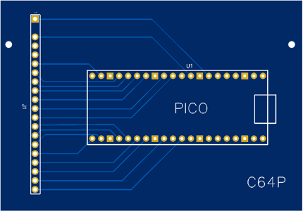
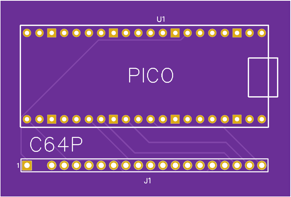

# Commodore 64 Pico (C64P) Legacy Documentation

Building the firmware with legacy pinout (after setting up your build environment, and checking out this repository in the `keyboards/` folder):

    qmk compile -kb c64p -km default -e LEGACY_PINOUT=1

## Schematic

### PCBs

Two different PCBs are available:

[C64P Case](pcb/Gerber_PCB_C64%20Keyboard_2023-03-25.zip), designed to be mounted inside an original C64C case

[C64P Compact](pcb/Gerber_PCB_C64%20Keyboard_Compact_2023-03-25.zip), designed to be mounted on the back of the keyboard

