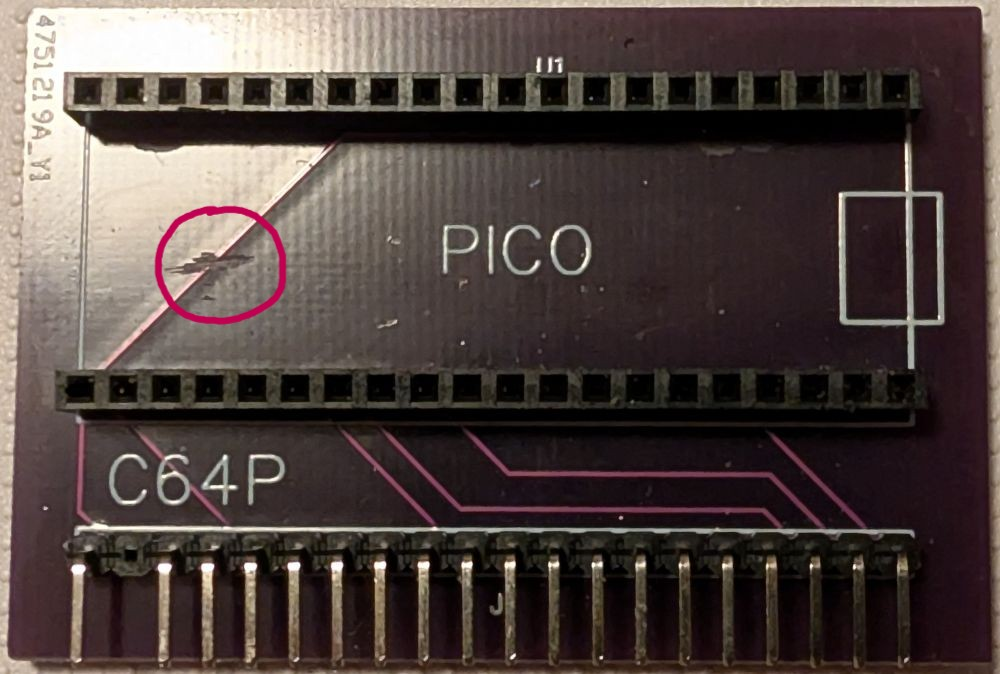
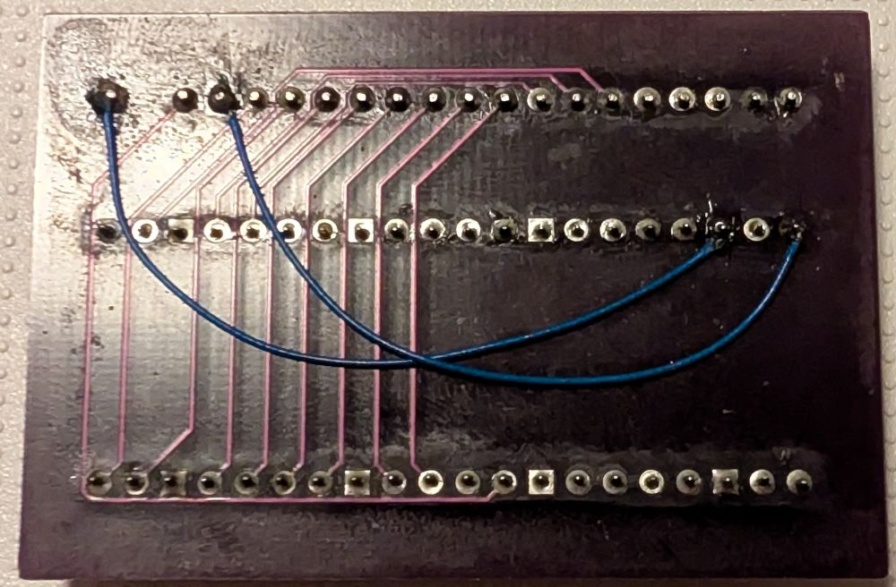
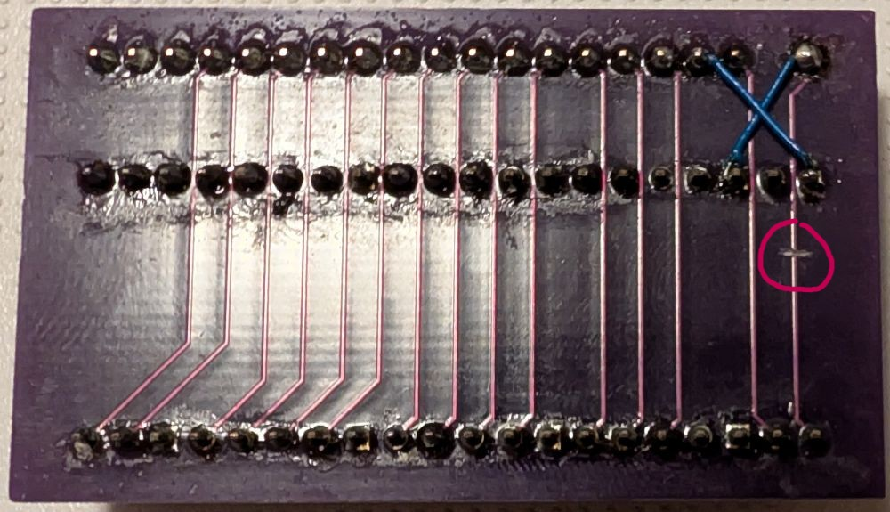
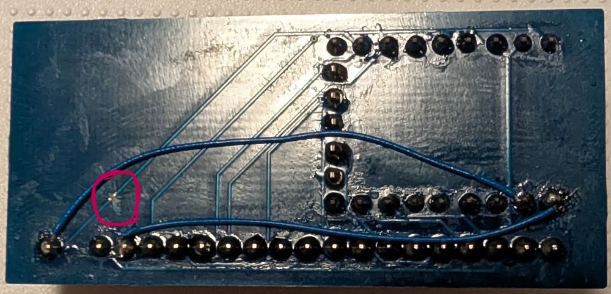

# Modifications

Any of the pre v4.0 PCBs can be modified to work with v4.0 or greater firmware.

Once a PCB is modified it **WILL NOT** work with the older firmware.

Note: Proceed **AT YOUR OWN RISK**. If in doubt just order new v4.0 PCBs.

## Modification Steps

The steps are the same for any PCB. They are:

 * Cut the trace leading from Pin 1 on C64 header to the GPIO header on the Pico/RP2040-Zero.
   * Note: This will be going to GPIO 5 on Unversioned boards and GPIO 0 on v2.0 boards. 
 * Connect Pin 1 on C64 header to GND on the Pico/RP2040-Zero. 
   * Any ground pin on the Pico/RP2040-Zero, it doesn't matter which.
 * The next step is **ONLY** needed if you want to support the Mechboard 64, you **DO NOT** need to do this for original C64 keyboards to work.
   * Connect Pin 4 on C64 header to VBUS or +5V on Pico/RP2040-Zero. 
   * Note: As explained in the [Keyboards section](README.md#keyboards), direct connection of the 5V from the microcontroller will lead to LEDs that will not have a consistent brightness. The older PCBs don't have space to add a DDO603SA, therefore your options are:
     * Wire up a DDO603SA as per the schematic and it will just hang loose from it's wires
     * Don't add it and accept the inconsistent brightness
     * Order a v4.0 PCB - This is your **BEST** option. 
 * Update the Pico/RP2040-Zero with the correct firmware:
   * `c64p_default.uf2` - for v2.0 PCBs
   * `c64p_legacy_default.uf2` - for Unversioned PCBs
 * That's it!

## Sample modified PCBs

Below are some pictures of some PCBs I modified to work with firmware v4.0

### Unversioned

Below circled in **red** is the cut trace from Pin 1 on the top side of an unversioned PCB.

The wires shown on the bottom side here show the re-routing of ground and +5V.

### v2.0

On the v2.0 PCB all mods can be done on the bottom side. 

Below circled in **red** is the cut trace, and the wires show the re-routing of ground and +5V.

