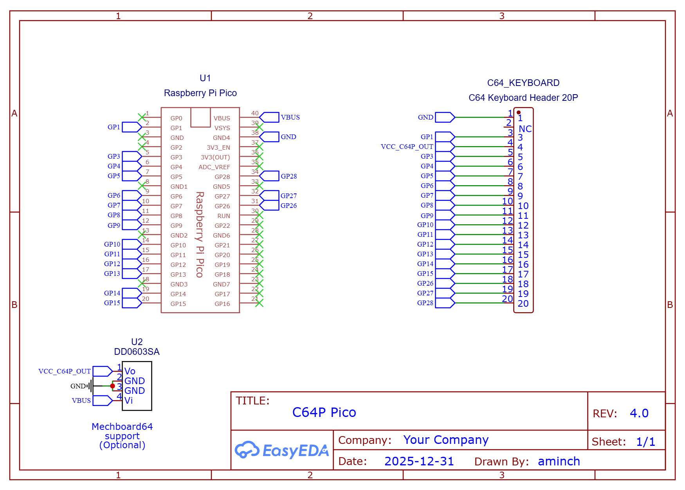
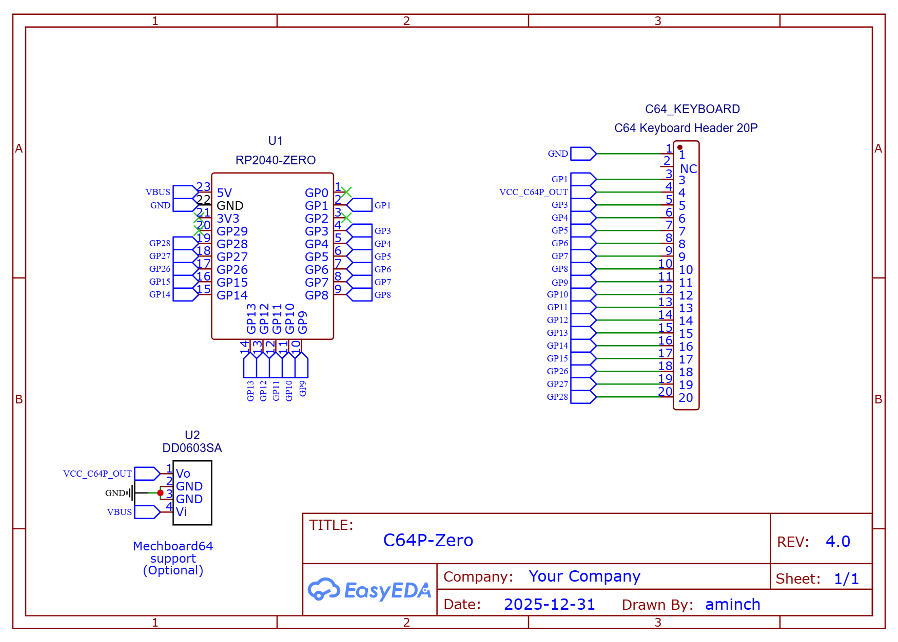
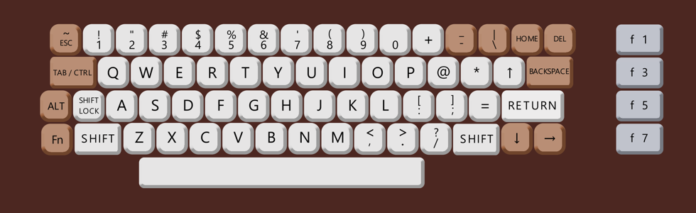
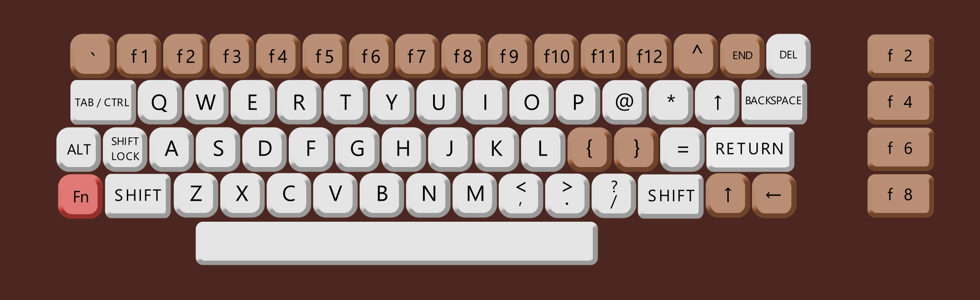
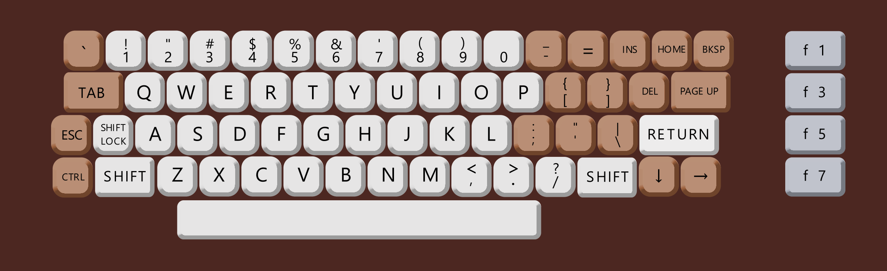
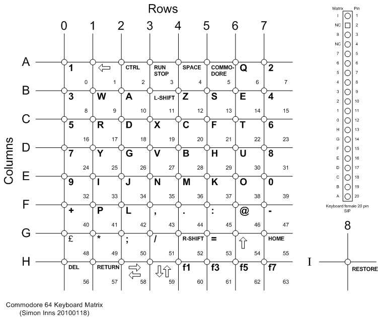

# Commodore 64 Pico (C64P)

C64P is a [QMK](https://qmk.fm/) based keyboard firmware for the Raspberry Pi Pico or RP2040-Zero to connect an original C64 keyboard via USB

* Keyboard Maintainer: [aminch](https://github.com/aminch)
* Hardware Supported: Raspberry Pi Pico or RP2040-Zero and original Commodore 64 keyboard

Supports PC and BMC64 modes:

* PC Mode: Requires US Layout on PC, keyboard functions as a regular keyboard with shift and function layers.
    * Press `RUN/STOP + F1` to switch into PC Mode
* BMC64 Mode: Layout specifically for [BMC64](https://accentual.com/bmc64/), plug and play
    * Press `RUN/STOP + F3` to switch into BMC64 Mode
* Vice Mode: Layout specifically for Vice Emulator. 
    * Press `RUN/STOP + F5` to switch into Vice Mode

Note: Current mode will be retained even after the keyboard is disconnected.

Building this firmware (after setting up your build environment, and checking out this repository in the `keyboards/` folder):

    qmk compile -kb c64p -km default

Flashing for this firmware:

    Drop the uf2 file onto the Pi Pico / RP2040-Zero after connecting with the BOOTSEL key held down.

See the [build environment setup](https://docs.qmk.fm/#/getting_started_build_tools) and the [make instructions](https://docs.qmk.fm/#/getting_started_make_guide) for more information. Brand new to QMK? Start with our [Complete Newbs Guide](https://docs.qmk.fm/#/newbs).

## Revisions

There have been three major PCB revisions of the C64P adapter and it's use in the [BMC64-PCB](https://github.com/aminch/bmc64-pcb) project.

 * **v4.0** - Support added for Mechboard 64. PCBs are marked with v4.0.
 * **v2.0** - Support added for RP2040-Zero which required new GPIO pin layout. PCBs are marked with v2.0. [Details](VERSION2.md) - **DEPRECATED**
 * **Unversioned** - Original unversioned PCBs (different GPIO pin layout). PCBs have no version marking. [Details](LEGACY.md) - **DEPRECATED**

Check the detail links above or the [MODIFICATIONS.md](MODIFICATIONS.md) readme if you are looking to continue to use an older PCB. Do this at your own risk!! If in doubt use the latests PCBs.
  
## Schematic

## PCBs

PCBs are available in a number of different form factors for both the Pi Pico and RP2040-Zero. When ordering from your favourite PCB manufacturer be sure to check you have the right gerber file after uploading.

Note: all PCBs require firmware v4.0 or greater

### Pi Pico

 * C64 Case Mount [Gerber](pcb/v4/Gerber_C64-Keyboard-Pico-v4_PCB_C64-Keyboard-Pico-Case-Mount-v4_2026-01-01.zip) - [Image](pcb/v4/c64p-pico-case-mount-pcb-v4.png)
 * Compact [Gerber](pcb/v4/Gerber_C64-Keyboard-Pico-v4_PCB_C64-Keyboard-Pico-v4_2026-01-01.zip) - [Image](pcb/v4/c64p-pico-pcb-v4.png)

### RP2040-Zero

 * C64 Case Mount [Gerber](pcb/v4/Gerber_C64-Keyboard-Zero-v4_PCB_C64-Keyboard-Zero-Case-Mount-v4_2026-01-01.zip) - [Image](pcb/v4/c64p-zero-case-mount-pcb-v4.png)
 * Compact [Gerber](pcb/v4/Gerber_C64-Keyboard-Zero-v4_PCB_C64-Keyboard-Zero-Compact-v4_2026-01-01.zip) - [Image](pcb/v4/c64p-zero-compact-pcb-v4.png)

## Compatibility

Up until version 4.0 the versioning of the PCBs and firmware was not in sync and a mess. From version 4.0, the PCB and firmware have matching major version numbers to make things simpler.

### PCB / Firmware Compatibility Matrix

Compatibility matrix of PCB (hardware) versions vs firmware (software) releases. Use this to select the correct firmware file to use if you are using an older PCB.

 * Rows = PCB version. 
 * Columns = firmware version (the version of the UF2 you flash).

| PCB version | Firmware v1.x | Firmware v2.0 | Firmware v3.0 | Firmware v4.0 |
| --- | --- | --- | --- | --- |
| Unversioned (Legacy) | **Yes** | **Yes**  | **Yes** - (*legacy*) | **Yes** - (*legacy* + *PCB modification*) |
| v2.0 | -- | -- | **Yes** | **Yes** - (*PCB modification*) |
| v4.0 (Mechboard 64 support) | -- | -- | -- | **Yes** |

Legend: 
 * -- : Not supported
 * Yes: `c64p_default.uf2` = use standard build 
 * *legacy*: `c64p_legacy_default.uf2` = use legacy-pinout build (only applies to unversioned PCBs)
 * *PCB modification*: Older PCBs can be modified to work with v4.0 or later firmware. See [MODIFICATIONS.md](MODIFICATIONS.md). Do this at your own risk!!

### Keyboards

The C64P is compatible with: 

 * Original C64 keyboards
 * [Mechboard 64](https://www.retrofuzion.com/products/mechboard-64-fully-backlit), with support added from version 4.0 onwards.

To support the Mechboard 64, it needs to have the 5V on pin 4 of the C64 Keyboard header active. You can just connect the 5V directly from the Pico/RP2040-Zero, it works, kinda, but there is not enough stable voltage from the microcontroller to keep the LEDs a constant brightness. I have added a header which can take an optional Canton-Power DDO603SA 5V Buck-Boost Converter Module (search Aliexpress) which looks to have solved the problem. 

If you are using an original C64 keyboard you can just leave the header for the DDO603SA unpopulated, it is not required.

## Layouts

### PC Mode Layout

The PC must be using US layout for keyboard input

Press `RUN/STOP + F1` to switch into PC Mode

Brown keys are modified from original for modern input, and TAB/CTRL will TAB if tapped, or act as CTRL if held.

Layout if the Fn (function) key is held

### BMC64 Layout

Press `RUN/STOP + F3` to switch into BMC64 Mode

Layout that should work with BMC64, right out of the box. Remember to set the keyboard to use **positional** layout.

### Vice Layout

Press `RUN/STOP + F5` to switch into Vice Mode

Layout should work with Vice emulator when paired with the correct vkm file (Suggested file: [sdl_c64p.vkm](https://github.com/aminch/vice-pi-compile/blob/main/data/C64/sdl_c64p.vkm)), and the operating system is set for a US keyboard layout. Remember to set the keyboard to use **positional** layout.

Additional features:

* Built in F12 combo with F1+F7 (to open Vice main menu)
* Up or Left arrow keys will work when shift is held and Down or Right arrow keys are pressed, as shown on a C64 keyboard.

**Note:** The Vice mode was built to support [this linked project](https://github.com/aminch/vice-pi-compile) which allow you to compile Vice onto a Raspberry Pi 4/5/400/500 running PiOS Lite, and then plug in an original C64 keyboard using this C64P keyboard adapter. It hasn't been tested in other setups. 

#### Testing

[Keyboard Tester](https://csdb.dk/release/?id=98411) is a great tool to check the layout inside emulation when running BMC64.

# Others

Other projects that can also be used to connect an original C64 keyboard via USB:

* [Keymmodore](https://www.keymmodore.com/) - A USB interface for Commodore Computers Keyboards and Joysticks
* [Retro Pico KMK Keyboards](https://github.com/midicdj1000/RETRO-PICO-KMK-Keyboards) - Uses KMK firmware to connect various retro keyboards including C64
* [Commodore 64 and VIC-20 keyboard matrix decoder](https://github.com/rumbledethumps/cbm2usb) - C project for the Pi Pico
* [Cheap and Easy Arduino C64 Keyboard to USB Adapter](https://retrogamecoders.com/arduino-c64-usb-keyboard/)

## Commodore Keyboard Matrix Information

* [C64 VICE Front-End](https://www.waitingforfriday.com/?p=470) - An original project building a front end for VICE, and connection of original C64 keyboard and joysticks. Has great details on the layout of the C64 keyboard matrix.

# Disclaimer

This project is just a fun personal experiment for education and is not intended for professional or commercial use. I'm not an electrical engineer, so please use any information, code, or designs here at your own risk.
