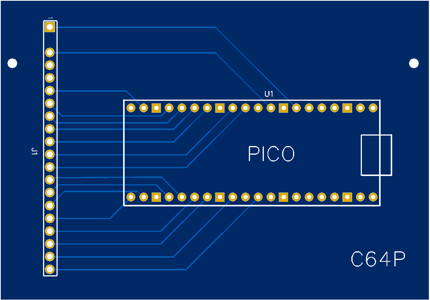
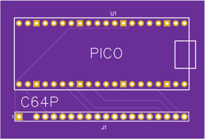

# Commodore 64 Pico (C64P)

C64P is a firmware for the Raspberry Pi Pico to connect an original C64 keyboard via USB

* Keyboard Maintainer: [aminch](https://github.com/aminch)
* Hardware Supported: Raspberry Pi Pico and original Commodore 64 keyboard

Supports PC and BMC64 modes:

* PC Mode: Requires US Layout on PC, keyboard functions as a regular keyboard with shift and function layers.
* BMC64 Mode: Layout specifically for [BMC64](https://accentual.com/bmc64/), plug and play

Note: Current mode will be retained even after the keyboard is disconnected.

Building this firmware (after setting up your build environment, and checking out this repository in the `keyboards/` folder):

    qmk compile -kb c64p -km default

Flashing for this firmware:

    Drop the uf2 file onto the Pi Pico after connecting with the BOOTSEL key held down.

See the [build environment setup](https://docs.qmk.fm/#/getting_started_build_tools) and the [make instructions](https://docs.qmk.fm/#/getting_started_make_guide) for more information. Brand new to QMK? Start with our [Complete Newbs Guide](https://docs.qmk.fm/#/newbs).

## Pinout

Connections between Pi Pico and C64 keyboard connector

```
     Pico GPIO       C64 Keyboard 
                        '-'
        GP5     <-->    |O|--1 
                        | |--2 Blank 
        GP6     <-->    |O|--3 
        NC      <-->    |O|--4 
        GP15    <-->    |O|--5 
        GP14    <-->    |O|--6 
        GP13    <-->    |O|--7
        GP12    <-->    |O|--8
        GP11    <-->    |O|--9
        GP10    <-->    |O|-10
        GP9     <-->    |O|-11
        GP8     <-->    |O|-12
        GP19    <-->    |O|-13
        GP18    <-->    |O|-14
        GP17    <-->    |O|-15
        GP16    <-->    |O|-16
        GP20    <-->    |O|-17
        GP21    <-->    |O|-18
        GP22    <-->    |O|-19
        GP26    <-->    |O|-20
                        '-'
```

### PCBs

Two different PCBs are also available:

[C64P Case](pcb/Gerber_PCB_C64%20Keyboard_2023-03-25.zip), designed to be mounted inside an original C64C case



[C64P Compact](pcb/Gerber_PCB_C64%20Keyboard_Compact_2023-03-25.zip), designed to be mounted on the back of the keyboard



## Layouts

### PC Mode Layout

The PC must be using US layout for keyboard input

Brown keys are modified from original for modern input, and TAB/CTRL will TAB if tapped, or act as CTRL if held.


Layout if the Fn (function) key is held


### BMC 64 Layout

Layout that should work with BMC64, right out of the box.


