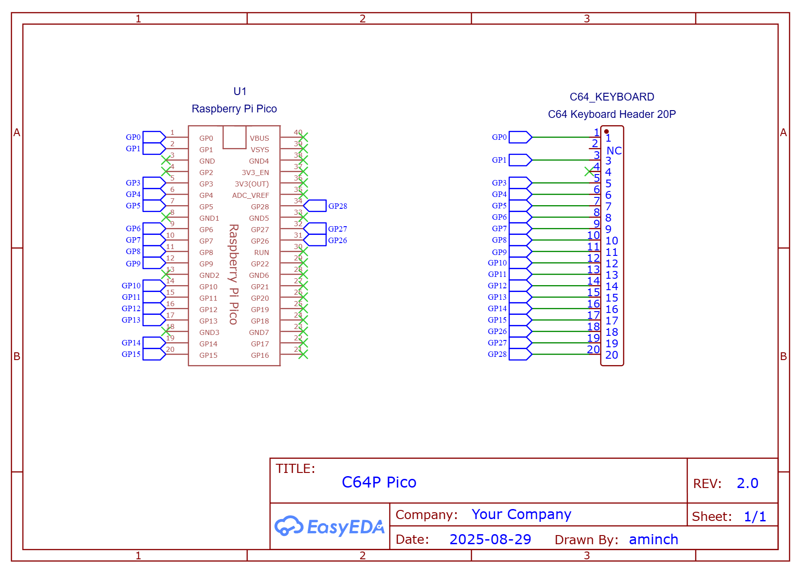
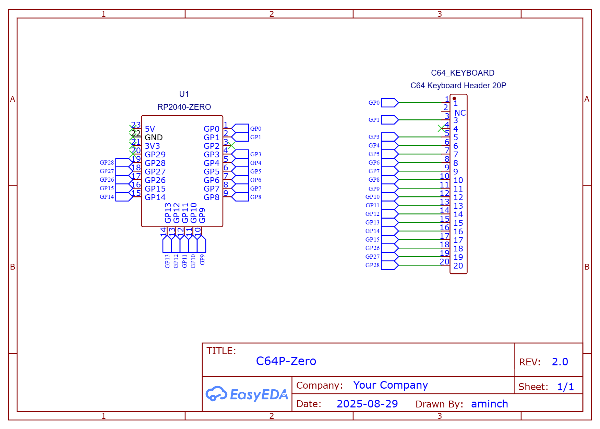

# Commodore 64 Pico (C64P)

C64P is a [QMK](https://qmk.fm/) based keyboard firmware for the Raspberry Pi Pico or RP2040-Zero to connect an original C64 keyboard via USB

* Keyboard Maintainer: [aminch](https://github.com/aminch)
* Hardware Supported: Raspberry Pi Pico or RP2040-Zero and original Commodore 64 keyboard

Supports PC and BMC64 modes:

* PC Mode: Requires US Layout on PC, keyboard functions as a regular keyboard with shift and function layers.
    * Press `RUN/STOP + F1` to switch into PC Mode
* BMC64 Mode: Layout specifically for [BMC64](https://accentual.com/bmc64/), plug and play
    * Press `RUN/STOP + F3` to switch into BMC64 Mode
* Vice Mode: Layout specifically for Vice Emulator. 
    * Press `RUN/STOP + F5` to switch into Vice Mode

Note: Current mode will be retained even after the keyboard is disconnected.

Building this firmware (after setting up your build environment, and checking out this repository in the `keyboards/` folder):

    qmk compile -kb c64p -km default

Flashing for this firmware:

    Drop the uf2 file onto the Pi Pico / RP2040-Zero after connecting with the BOOTSEL key held down.

See the [build environment setup](https://docs.qmk.fm/#/getting_started_build_tools) and the [make instructions](https://docs.qmk.fm/#/getting_started_make_guide) for more information. Brand new to QMK? Start with our [Complete Newbs Guide](https://docs.qmk.fm/#/newbs).

## Compatibility

The C64P is compatible with original C64 keyboards. 

It is currently **NOT** compatible with Mechboard64, which requires the 5V connection to power the LEDs and shift lock mechanism.

## Legacy

The pinout was changed to support both a regular Pi Pico and a RP2040-Zero from v3.0 and onward from a single build. 

It's still possible to build the latest firmware with the original pinout to support older PCBs. 

Build detail and full legacy documentation is found in the [LEGACY.md](LEGACY.md) readme.

## Schematic

## PCBs

PCBs are available in a number of different form factors for both the Pi Pico and RP2040-Zero. When ordering from your favourite PCB manufacturer be sure to check you have the right gerber file after uploading.

Note: all PCBs using the current pinout are labelled as v 2.0 or greater. They require v 3.0 or greater firmware uf2 files. 

### Pi Pico

 * C64 Case Mount [Gerber](pcb/Gerber_C64-Keyboard-Pico_PCB_C64-Keyboard-Pico-Case-Mount_2025-08-30.zip) - [Image](pcb/c64p-pico-case-mount-pcb.png)
 * Compact [Gerber](pcb/Gerber_C64-Keyboard-Pico_PCB_C64-Keyboard-Pico_2025-08-30.zip) - [Image](pcb/c64p-pico-pcb.png)

### RP2040-Zero

 * C64 Case Mount [Gerber](pcb/Gerber_C64-Keyboard-Zero_PCB_C64-Keyboard-Zero-Case-Mount_2025-08-30.zip) - [Image](pcb/c64p-zero-case-mount-pcb.png)
 * Regular [Gerber](pcb/Gerber_C64-Keyboard-Zero_PCB_C64-Keyboard-Zero_2025-08-30.zip) - [Image](pcb/c64p-zero-pcb.png)
 * Compact [Gerber](pcb/Gerber_C64-Keyboard-Zero_PCB_C64-Keyboard-Zero-Compact_2025-08-30.zip) - [Image](pcb/c64p-zero-compact-pcb.png)

## Layouts

### PC Mode Layout

The PC must be using US layout for keyboard input

Press `RUN/STOP + F1` to switch into PC Mode

Brown keys are modified from original for modern input, and TAB/CTRL will TAB if tapped, or act as CTRL if held.

Layout if the Fn (function) key is held

### BMC64 Layout

Press `RUN/STOP + F3` to switch into BMC64 Mode

Layout that should work with BMC64, right out of the box. Remember to set the keyboard to use **positional** layout.

### Vice Layout

Press `RUN/STOP + F5` to switch into Vice Mode

Layout should work with Vice emulator when paired with the correct vkm file (Suggested file: [sdl_c64p.vkm](https://github.com/aminch/vice-pi-compile/blob/main/data/C64/sdl_c64p.vkm)), and the operating system is set for a US keyboard layout. Remember to set the keyboard to use **positional** layout.

Additional features:

* Built in F12 combo with F1+F7 (to open Vice main menu)
* Up or Left arrow keys will work when shift is held and Down or Right arrow keys are pressed, as shown on a C64 keyboard.

**Note:** The Vice mode was built to support [this linked project](https://github.com/aminch/vice-pi-compile) which allow you to compile Vice onto a Raspberry Pi 4/5/400/500 running PiOS Lite, and then plug in an original C64 keyboard using this C64P keyboard adapter. It hasn't been tested in other setups. 

#### Testing

[Keyboard Tester](https://csdb.dk/release/?id=98411) is a great tool to check the layout inside emulation when running BMC64.

# Others

Other projects that can also be used to connect an original C64 keyboard via USB:

* [Keymmodore](https://www.keymmodore.com/) - A USB interface for Commodore Computers Keyboards and Joysticks
* [Retro Pico KMK Keyboards](https://github.com/midicdj1000/RETRO-PICO-KMK-Keyboards) - Uses KMK firmware to connect various retro keyboards including C64
* [Commodore 64 and VIC-20 keyboard matrix decoder](https://github.com/rumbledethumps/cbm2usb) - C project for the Pi Pico
* [Cheap and Easy Arduino C64 Keyboard to USB Adapter](https://retrogamecoders.com/arduino-c64-usb-keyboard/)

## Commodore Keyboard Matrix Information

* [C64 VICE Front-End](https://www.waitingforfriday.com/?p=470) - An original project building a front end for VICE, and connection of original C64 keyboard and joysticks. Has great details on the layout of the C64 keyboard matrix.

