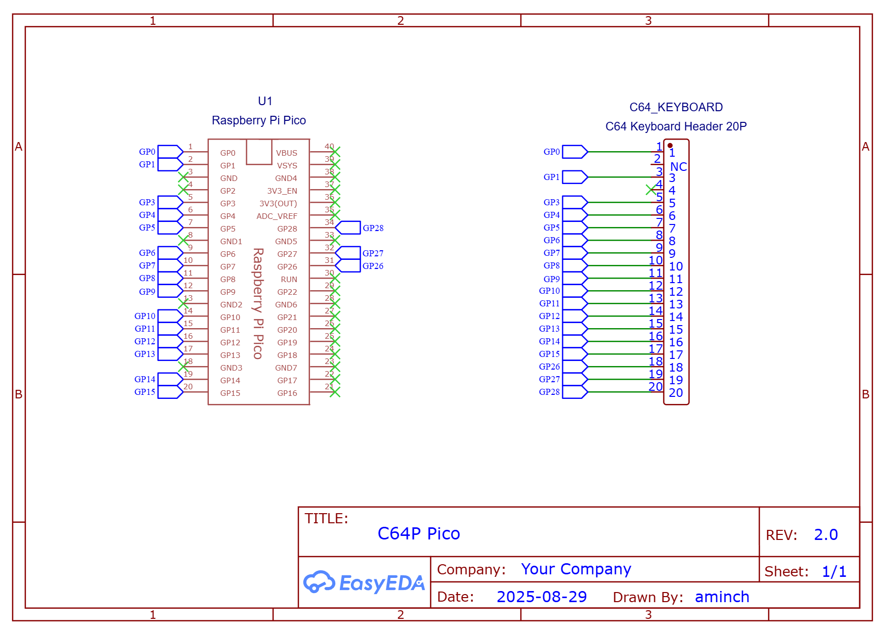
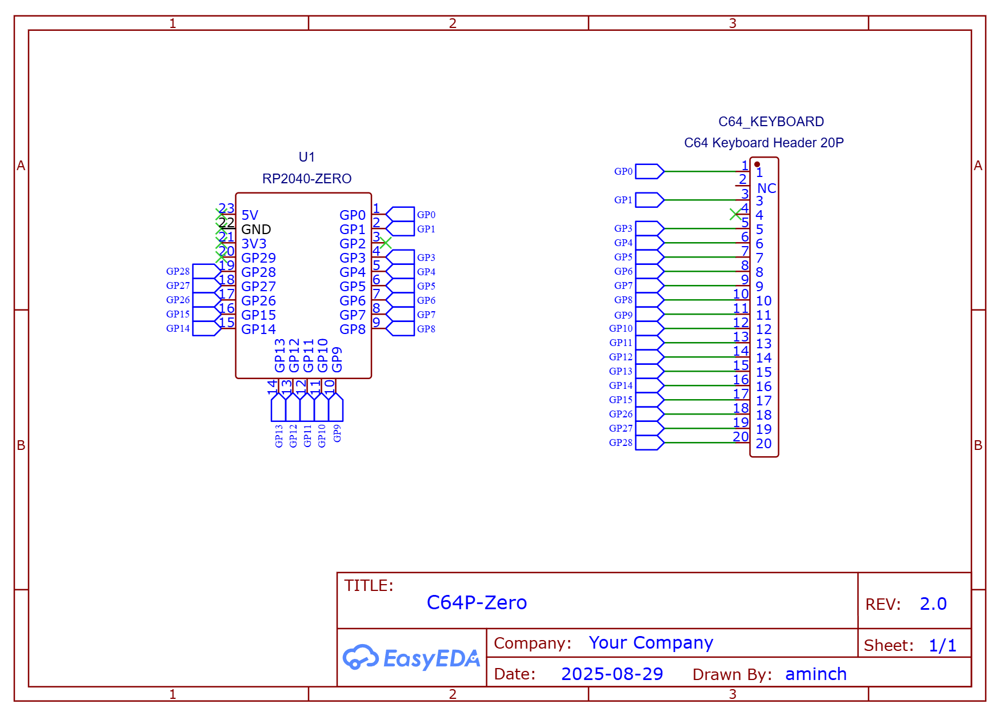

# Commodore 64 Pico (C64P) v2.0 PCB Documentation

This page contains the schematics, images and gerbers of the **DEPRECATED** v2.0 PCBs.

Refer to the [MODIFICATIONS.md](MODIFICATIONS.md) for details on how to modify a v2.0 PCB to work with firmware v4.0 or greater.

Refer to the [Compatibility Matrix](README.md#pcb--firmware-compatibility-matrix) for details on firmware compatibility before or after modification.

## Schematic

## PCBs

PCBs are available in a number of different form factors for both the Pi Pico and RP2040-Zero. When ordering from your favourite PCB manufacturer be sure to check you have the right gerber file after uploading.

Note: all PCBs using the current pinout are labelled as v 2.0 or greater. They require v 3.0 or greater firmware uf2 files. 

### Pi Pico

 * C64 Case Mount [Gerber](pcb/Gerber_C64-Keyboard-Pico_PCB_C64-Keyboard-Pico-Case-Mount_2025-08-30.zip) - [Image](pcb/c64p-pico-case-mount-pcb.png)
 * Compact [Gerber](pcb/Gerber_C64-Keyboard-Pico_PCB_C64-Keyboard-Pico_2025-08-30.zip) - [Image](pcb/c64p-pico-pcb.png)

### RP2040-Zero

 * C64 Case Mount [Gerber](pcb/Gerber_C64-Keyboard-Zero_PCB_C64-Keyboard-Zero-Case-Mount_2025-08-30.zip) - [Image](pcb/c64p-zero-case-mount-pcb.png)
 * Regular [Gerber](pcb/Gerber_C64-Keyboard-Zero_PCB_C64-Keyboard-Zero_2025-08-30.zip) - [Image](pcb/c64p-zero-pcb.png)
 * Compact [Gerber](pcb/Gerber_C64-Keyboard-Zero_PCB_C64-Keyboard-Zero-Compact_2025-08-30.zip) - [Image](pcb/c64p-zero-compact-pcb.png)

