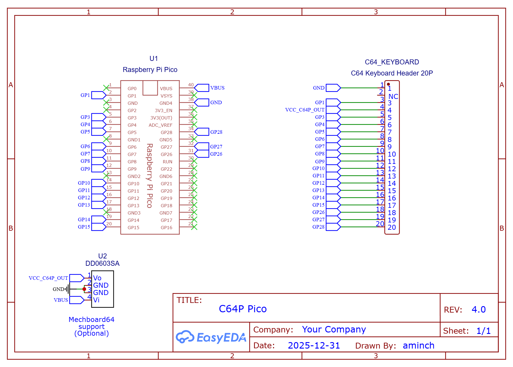
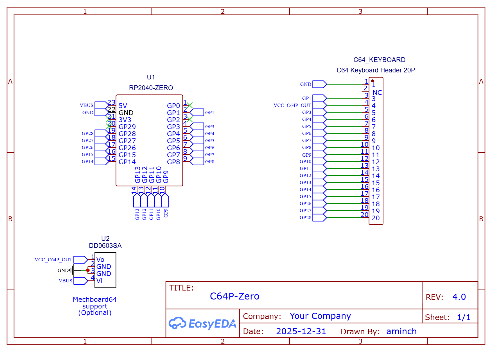

# Commodore 64 Pico (C64P) v4.0 Documentation

This page contains the schematics, images and gerbers of the **DEPRECATED** v4.0 PCBs.

Refer to the [Compatibility Matrix](README.md#pcb--firmware-compatibility-matrix) for details on firmware compatibility before or after modification.

## Schematic

## PCBs

PCBs are available in a number of different form factors for both the Pi Pico and RP2040-Zero. When ordering from your favourite PCB manufacturer be sure to check you have the right gerber file after uploading.

Note: all PCBs require firmware v4.0 or greater

### Pi Pico

 * C64 Case Mount [Gerber](pcb/v4/Gerber_C64-Keyboard-Pico-v4_PCB_C64-Keyboard-Pico-Case-Mount-v4_2026-01-01.zip) - [Image](pcb/v4/c64p-pico-case-mount-pcb-v4.png)
 * Compact [Gerber](pcb/v4/Gerber_C64-Keyboard-Pico-v4_PCB_C64-Keyboard-Pico-v4_2026-01-01.zip) - [Image](pcb/v4/c64p-pico-pcb-v4.png)

### RP2040-Zero

 * C64 Case Mount [Gerber](pcb/v4/Gerber_C64-Keyboard-Zero-v4_PCB_C64-Keyboard-Zero-Case-Mount-v4_2026-01-01.zip) - [Image](pcb/v4/c64p-zero-case-mount-pcb-v4.png)
 * Compact [Gerber](pcb/v4/Gerber_C64-Keyboard-Zero-v4_PCB_C64-Keyboard-Zero-Compact-v4_2026-01-01.zip) - [Image](pcb/v4/c64p-zero-compact-pcb-v4.png)

